# [AMOTH] 영화 사운드트랙 추천&커뮤니티 서비스 MSA로 구현하기

AMOTH는 영화 사운드트랙 추천&커뮤니티 서비스입니다

AMOTH의 뜻은 A man of the hour로

이 자리(파티, 모임 등)의 주인공, 화제의 인물, 시대를 풍미한 인물 등의 의미로 많이 사용됩니다

우리는 음악을 들을 때 평범한 것들이 특별하게 되거나

마치 내가 영화 주인공이 된 것 같은 느낌을 받을 때가 있습니다

서비스의 이름처럼 이 서비스를 이용하는 사용자가

영화의 사운드트랙을 들으며 잠시라도 영화 주인공처럼 특별한 사람이 되기를 바랍니다

## 👨🏻‍💻Contributors

| 김동훈                                                                                         | 엄한결                                                                                                                             |
|:-------------------------------------------------------------------------------------------:|:-------------------------------------------------------------------------------------------------------------------------------:|
|  |  |
| **프론트엔드**                                                                                   | **백엔드**                                                                                                                         |

커밋 컨벤션 rule : AngularJS Commit Message Convention

## 🔗 목차

- 서비스 배경

- 서비스 소개
  
  - Information Architecture
  - System Architecture

- 개발 핵심 기능
  
  - Back Server
  - Front Server

## 🏙️ 배경 Problem

1. [영화음악이 영상에 미치는 효과](https://www.kci.go.kr/kciportal/ci/sereArticleSearch/ciSereArtiView.kci?sereArticleSearchBean.artiId=ART002199626)
   
   - 영화음악은 영상으로는 묘사하지 못하는 영화 이면에 있는 본질을 표현할 수 있음

2. 영화의 사운드 트랙을 들으면 한편의 영화를 보는 것 같은 효과를 줌

3. 날씨와 기분과 맞아떨어지는 음악을 들을 때 마치 내가 주인공이 된듯한 경험이 있음

> 사용자의 위치의 날씨와 어울리는 영화와 사운드 트랙을 추천하고
> 
> 영화의 사운드 트랙을 쉽게 제공함으로써
> 
> - 사용자가 좋아하는 영화에 담긴 의미들을 알 수 있는 경험을 제공
> - 사운드 트랙을 들으며 영화를 본 것 같은 경험을 제공
> - 사운드 트랙을 들으며 영화의 주인공이 된 것 같은 경험을 제공
> - 사운드 트랙을 들음으로써 보고 싶어지는 영화를 찾게되는 경험을 제공

## 🎧 서비스 소개

> 사용자의 위치의 날씨와 어울리는 영화와 사운드 트랙을 추천하고
> 
> 영화의 사운드 트랙을 쉽게 제공함으로써
> 
> - 사용자가 좋아하는 영화에 담긴 의미들을 알 수 있는 경험을 제공
> - 사운드 트랙을 들으며 영화를 본 것 같은 경험을 제공
> - 사운드 트랙을 들으며 영화의 주인공이 된 것 같은 경험을 제공
> - 사운드 트랙을 들음으로써 보고 싶어지는 영화를 찾게되는 경험을 제공

### 서비스 정보 구조 Information Architecture

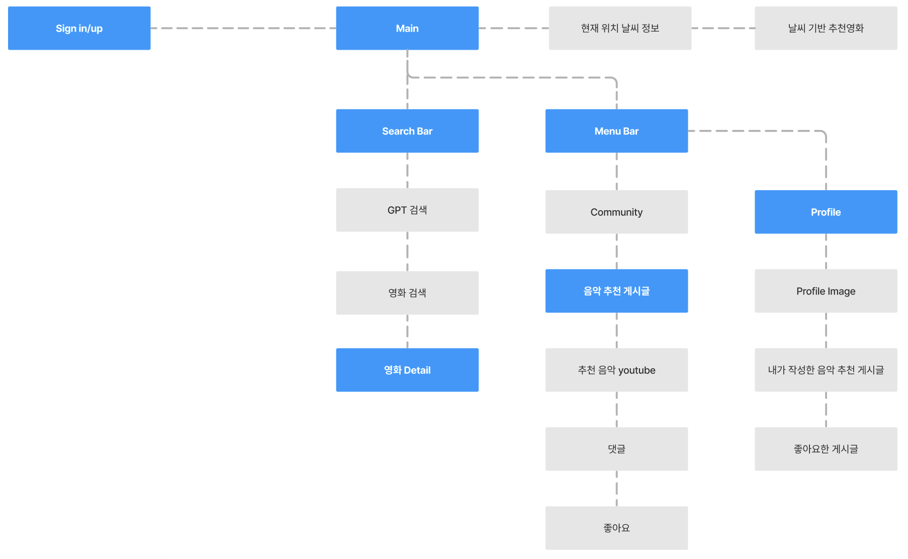

### 시스템 아키텍처 System Architecture

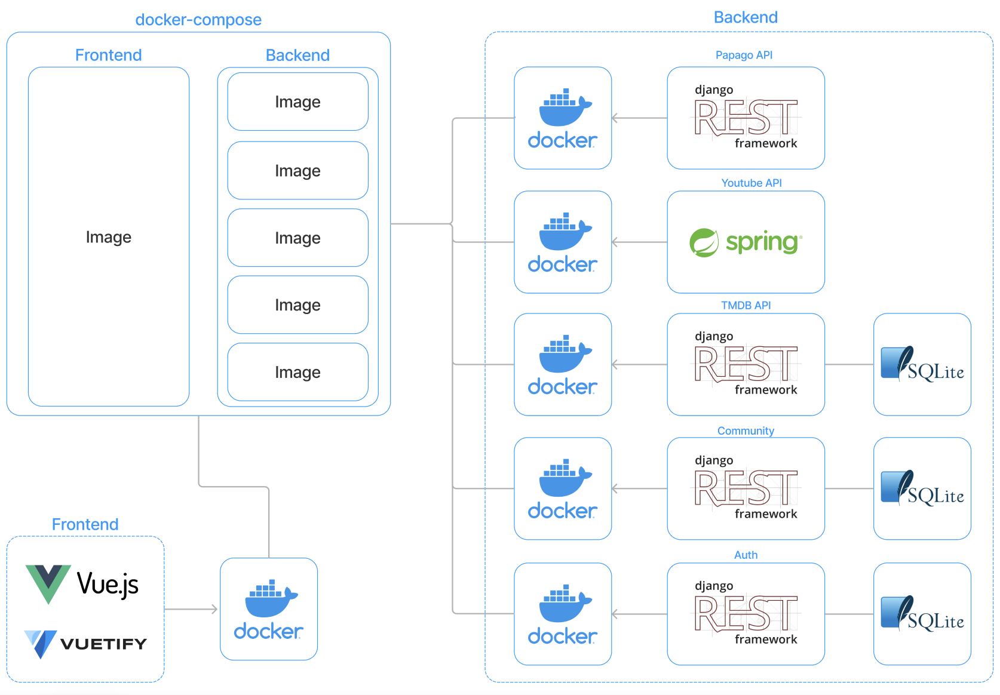

- 백엔드
  
  - MSA의 개념을 토대로 기능별로 나누어 하나의 프로젝트에 하나의 앱만 있도록 구성하고
    
    통합 DB가 아닌 각각의 기능과 관련된 데이터만 들어가도록 개별의 DB를 가지도록  했다
  
  - 각각의 기능(프로젝트)를 Docker를 이용해 Container로 만들고 다수의 Container들을 통합 관리 및 실행

## ⚙️ 개발 핵심 기능

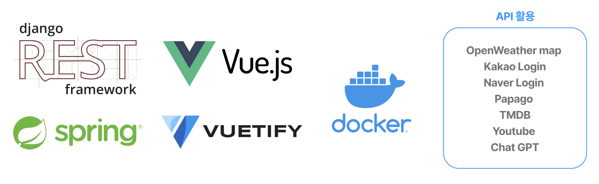

### Back Server

> ⚙️django REST framework, Spring boot, docker, SQLite3
> 
> 📡Oauth2(Naver, Kakao), Papago API, TMDB API, Youtube API

### 🎯 목표

1. REST API 구축
   
   - URI 도 REST API URI규칙을 최대한 지켜가며 설정하기

2. API
   
   - 최대한 많은 API 사용해보며 API사용에 익숙해지기

3. MicroService Architecture (MSA)
   
   > **느슨하게 결합된 서비스의 모임으로 구조화하는 *서비스 지향 아키텍처(SOA) 스타일의 일종인 소프트웨어 개발 기법**
   > 
   > - 독립적으로 배포 가능한 각각의 기능을 수행하는 서비스로 구성
   > - 각각이 하나의 서비스 기능만 수행
   > - 어플리케이션을 다양한 언어와 기술로 구축 가능
   > 
   > 따라서,
   > 
   > ****기능별 기술 스택을 다르게 가져갈 수 있음****
   > 
   > ****각각 개별의 서비스 개발을 빠르게하며 유지보수가 쉬움****
   > 
   > ****서비스별로 독립적 배포 및 다른 서비스에서 재사용 가능****
   
   - 소규모의 프로젝트에서는 **MSA**보다는
     
     기존의 (소프트웨어의 구성요소가 한 프로젝트에 통합되어 있는 형태인)
     
     **Monolithic Architecture**가 더 효율적인 것을 알고 있지만
     
     그래도 MSA의 개념을 직접 느껴보기 위해
     
     실제 MSA가 나누는 정도보다 비교적 크더라도 기능별로 나눠보기
- 기술 스택을 기능별로 다르게 가져갈 수 있는 장점을 보여주기 위해
  
  하나의 기능은 꼭 Spring boot로 구현하기
4. Docker
   
   > 기존 웹개발 과정
   > 
   > 운영체제 -> 파이썬 설치 -> VSC설치 -> 프레임워크(Django 등) 설치 ->
   > 
   > 각종 라이브러리 설치 ...
   > 
   > 만약 이걸 다른 환경에서 마저 개발하고 싶을 땐? (각각의 환경이 모두 다를 때)
   > 
   > 깃허브 등의 다양한 방법을 통해 코드 옮기기 -> 프로그래밍 언어 설치 ->
   > 
   > 프레임워크 설치 -> 라이브러리 설치 ... 반복
   > 
   > 이렇게 개발 환경이 다르기 때문에 발생하는 불편함을 해소하기 위해
   > 
   > 가상머신(Virtual Machine) 존재
   > 
   > 
   > 
   > 가상머신으로 하면 되는데 왜 도커가 핫할까?
   > 
   > 가상머신 -> 컴퓨터안에 가상의 컴퓨터 환경을 만듦 -> OS를 또 설치
   > 
   > ->  속도 저하 및 많은 리소스 사용
   > 
   > 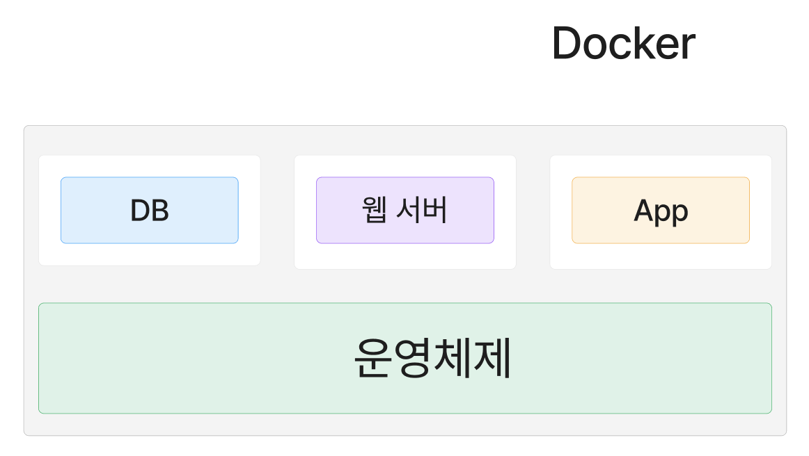
   > 
   > 반면, 도커는 격리된 공간(Container)에 프로그램을 실행시키는데 필요한
   > 
   > 라이브러리, 실행파일만 담아놓고 사용!!
   > 
   > -> 비교적 리소스 감소, 속도 향상
   > 
   > \+ 도커는 이러한 컨테이너 생성 및 관리가 매우 용이 (배포)
   > 
   > 즉, 가벼운 모듈식(경량화) 가상머신
   
   - 추후 해당 프로젝트를 개발, 관리, 배포를 편하게 하기위해 도커를 사용해
     
     각각의 기능의  Docker image 생성하기
   
   - 그렇게 생성된 Container들을 Docker-compose를 이용해 여러개의 Container로 이루어진 서비스를 구축 및 실행 자동화하기

#### ERD Entity Relationship Diagram

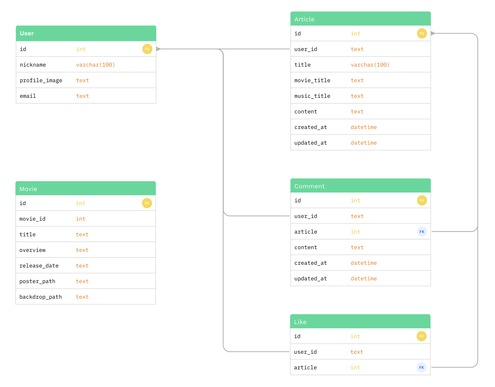

#### URI

- REST API URI 규칙
  
  1. URI 마지막에 슬래시(/)를 붙이지 마세요
  2. 관계를 나타내기 위해 슬래시(/)를 사용하세요
  3. 하이픈(-)를 사용하세요
  4. 언더바(_)를 사용하지 마세요
  5. 소문자를 선호하세요
  6. URI에 파일 확장자를 사용하지 마세요

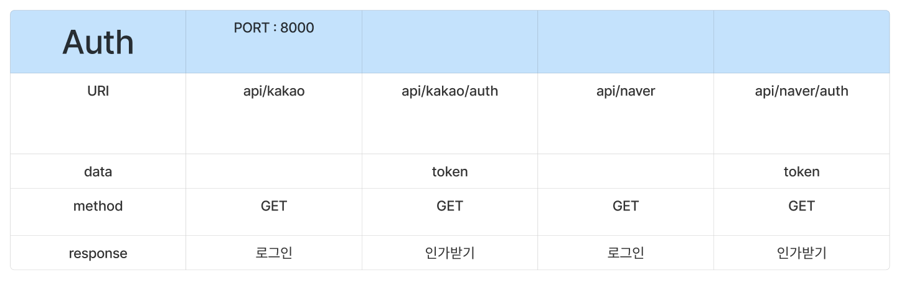

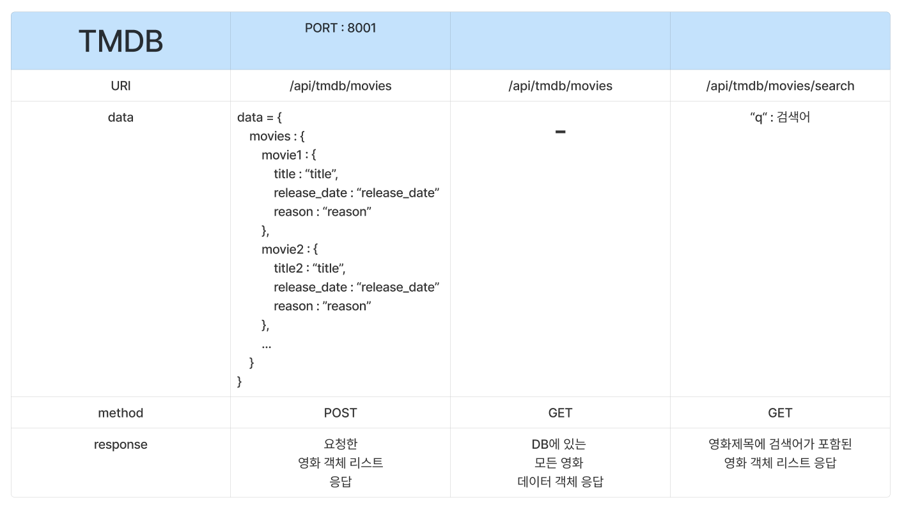

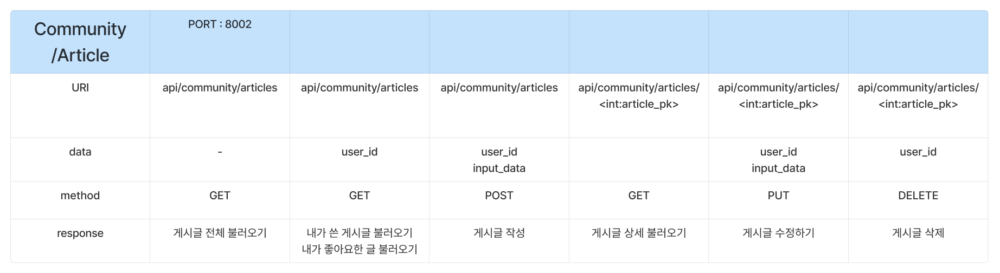

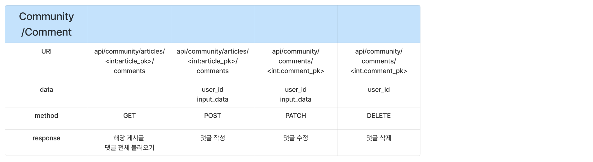

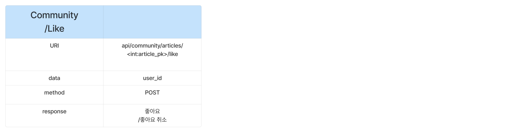

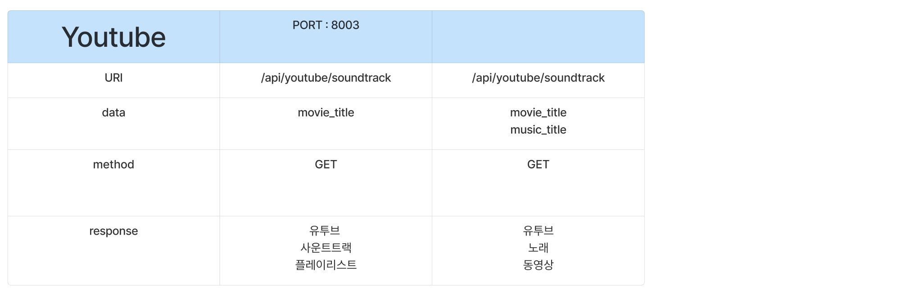

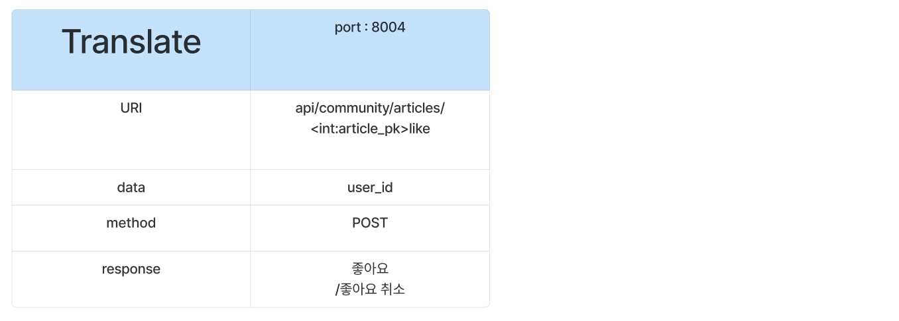

#### 주요 기능 프로세스 Process

##### 1. Authentication, Authorization

인증 및 인가 방식은 Oauth2.0 방식인 Kakao, Naver Login API를 이용함

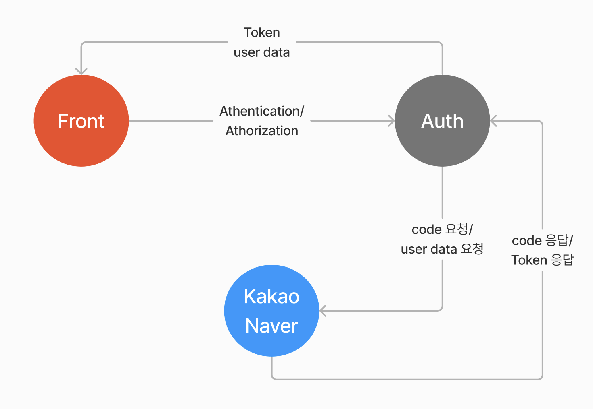

##### 2. MicroService Architecture CRUD

MicroService Architecture 이기 때문에 각각이 하나의 기능만을 수행

TMDB API 서비스와 Community 서비스는 `<b>`Django Rest Framework `</b>`로

Youtube API 서비스는 **Spring boot**로 구현하여

MSA의 장점인 **기술 스택을 다르게할 수 있음**을 보였다

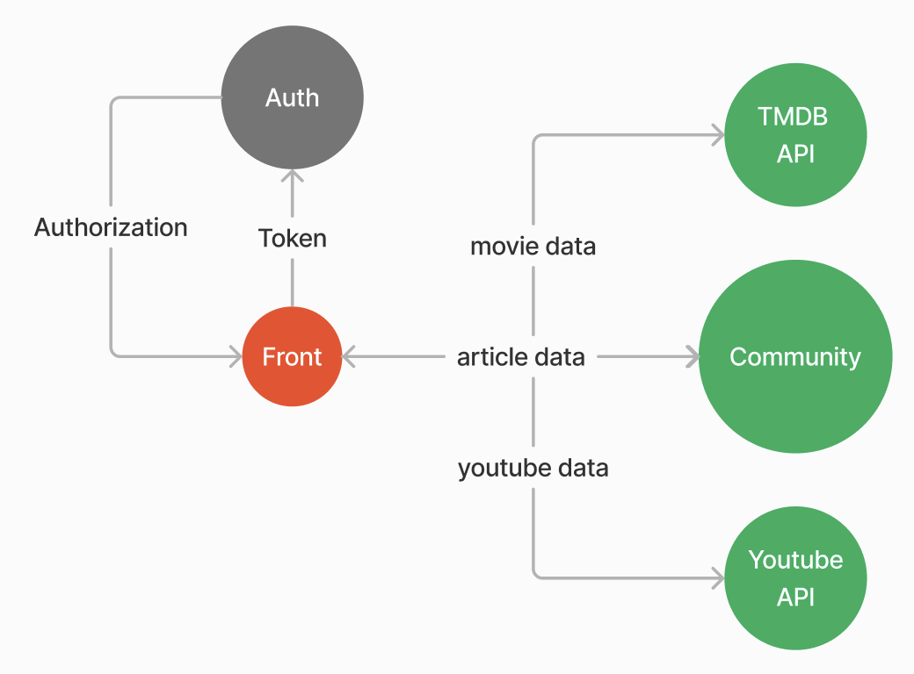

##### 3. Movie Recommend

front에서 날씨 데이터를 바탕으로 Chat GPT에게 받은 추천영화 데이터를 받으면

TMDB API 서비스에서 TMDB API에 요청하고 응답 받은 정확한 영화 데이터를

저장 및 응답한다

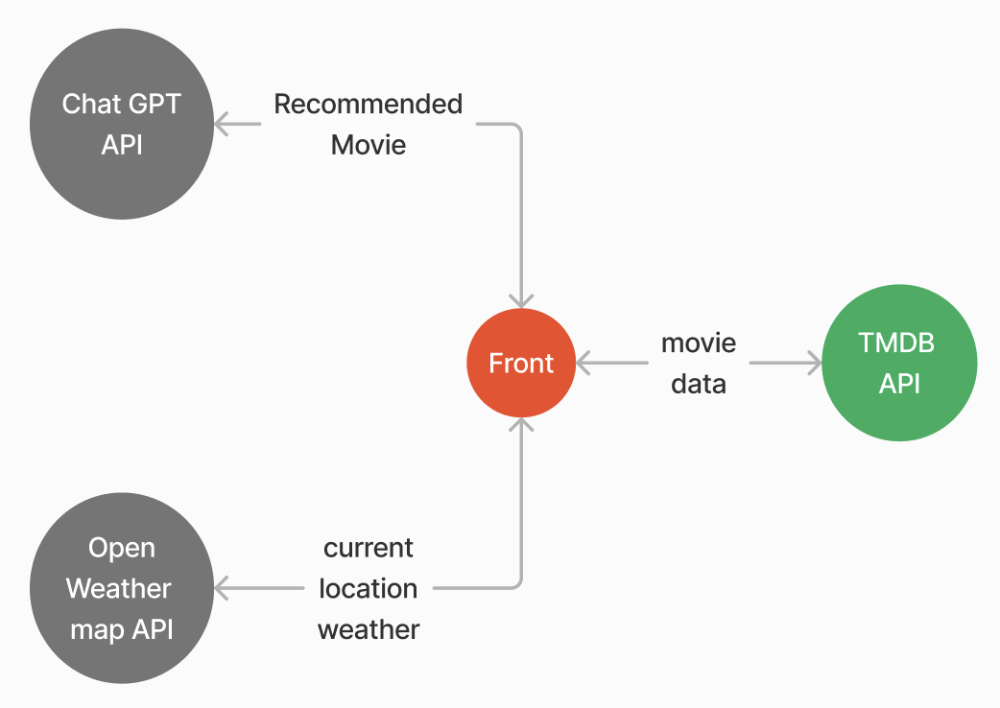

##### 4. Movie Search

Front에서 사용자가 검색을 위해 입력한 Text를 TMDB API서비스로 보내면

TMDB API서비스가 Papago API 서비스로 Text를 보내어 어떤 언어인지 감지하고

영어로 번역하여 DB에서 해당 (번역된)Text가 포함된 영화들을 응답한다

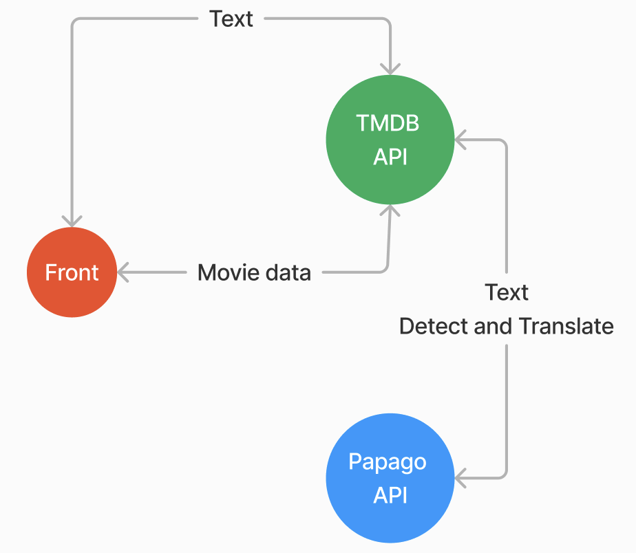

### 😮‍💨 고찰 및 수정사항

9일 (23년 5월 17일 ~ 5월 25일) 정도의 짧은 기간동안 빠르게 개발해야하는 상황이어서

알고있지만 신경쓰지 못한 부분과 다 하고나서야 알게된 부분들이 많았다

이러한 부분들을 정리해놓고 수정하며 발전시켜 나갈 예정이기 때문에 정리 해놓으려 한다

- 객체지향 프로그래밍
  
  - 무작정 돌아가는 함수만 짜고 객체지향 프로그래밍은 전혀 신경 쓰지 않았다.
    
    사실 전혀 할 줄 모른다.
    
    **무조건** 객체지향 프로그래밍, 클린코드를 공부하고
    
    Class를 통한 추상화, 상속, 다형성, 캡슐화 4가지 특징을 살리는
    
    코드로 수정할 것이다.

- 코드 리팩토링
  
  - 인증과 인가 부분을 Oauth2.0을 사용하기로 결심했을 때
    
    처음에 Kakao Login API만 사용하자라고 생각했다가
    
    하나만 있으면 허전할 것 같아서 프로젝트 마감 하루전에
    
    Naver Login API도 추가했다.
    
    둘다 Oauth2.0 방식이고 프로세스가 100% 똑같기 때문에
    
    충분히 같은 함수 코드를 가지고 API url만 갈아 끼워주는 방식으로
    
    재활용 할 수 있는  코드를 작성할 수 있지만
    
    시간 부족으로 인해 빠르게 Naver login만 하는 함수를 하나 더 만들어서
    
    기능 추가를 진행했다.
    
    이 부분을 중복코드를 제거하고 리팩토링할 것이다.

- MSA 답지 못하고 마이크로라고 부르기 너무 애매한 서비스들
  
  - 진짜 MSA는 기능 단위가 더 세부적으로 나뉘어져 있고 연결성도 더 약하다
  
  - 이번(23.05.25) 프로젝트는 어설픈 MSA이며 하나의 프로젝트로 구축하는 것이 훠얼씬 효율적이고 간결한 형태였기에 시작한 것이 후회가 조금 된다
  
  - TMDB API 서비스는 처음엔 정말 API요청만 받고 응답하는 서비스로 구상했지만
    
    결국 영화 데이터를 저장하고 처리하는 Movie 서비스가 되어 버렸고
    
    Community도 게시글, 댓글, 좋아요 기능들이 한번에 들어있는 마이크로라부르기 너무나 힘든 서비스였다
    
    (그래도 youtube, papago, Oauth2(유저데이터 저장 제외) api는 정말 api요청만 처리하고 응답하는 서비스라 마음에 듬 )

### 🤔 향후 진행 방향

- docker 이미지 docker hub에 올리기 
  - https://velog.io/@eoveol/docker-docker-hub%EC%97%90-image-%EC%98%AC%EB%A6%AC%EA%B8%B0
- docker compose에서 이미지를 docker hub에서 가져오도록 하기 
  - https://velog.io/@eoveol/Docker-Docker-compose%EC%8B%9C-docker-hub%EC%97%90-%EC%9E%88%EB%8A%94-image-%EC%82%AC%EC%9A%A9%ED%95%98%EA%B2%8C-%ED%95%98%EA%B8%B0
- github action으로 CI/CD 자동화 해보기
  - CI : https://velog.io/@eoveol/CI-Github-Action%EC%9C%BC%EB%A1%9C-Docker-image-upload-%EC%9E%90%EB%8F%99%ED%99%94%ED%95%98%EA%B8%B0
- 백엔드의 마이크로 서비스들을 하나의 AWS EC2로 배포해보기
- Clean code 작성하기 (코드 리팩토링)
  - ~~auth~~
  - ~~community~~
  - ~~tmdb api~~
  - ~~translate api~~ 

### Front Server

[AMOTH_project/final-pjt-front at main · ah9mon/AMOTH_project · GitHub](https://github.com/ah9mon/AMOTH_project/tree/main/final-pjt-front)
