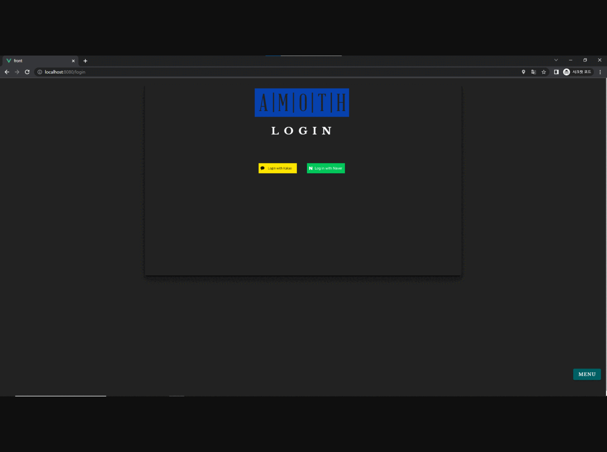
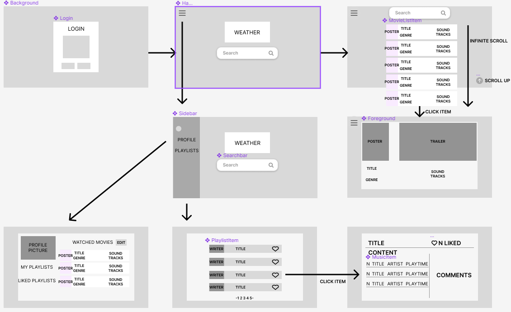

# front

## Project setup

```
node.js v18.16.0
front@0.1.0 Y:\SSAFY\AMOTH_project\final-pjt-front
├─┬ @vue/cli-plugin-babel@5.0.8
│ └─┬ @vue/babel-preset-app@5.0.8
│   ├─┬ @vue/babel-preset-jsx@1.4.0
│   │ └── vue@2.7.14 deduped
│   └── vue@2.7.14 deduped
├─┬ vue-infinite-loading@2.4.5
│ └── vue@2.7.14 deduped
├── vue@2.7.14
├─┬ vuetify-loader@1.9.2
│ └── vue@2.7.14 deduped
├─┬ vuetify@2.6.15
│ └── vue@2.7.14 deduped
└─┬ vuex@3.6.2
  └── vue@2.7.14 deduped
```

----

## 기능 요약

- 라이트모드/다크모드 지원
- 반응형 웹페이지
  

----

1. 목표 서비스 구현 및 실제 구현 정도

2. 영화 추천 알고리즘에 대한 기술적 설명

3. 서비스 대표 기능에 대한 설명

4. 기타 느낀 점, 후기 등

## 목표 서비스 구현 및 실제 구현 정도

- 목표 화면 구성:
  - 대부분의 페이지가 처음 wireframe 구성과 일치
  - sidebar의 경우 오른쪽 하단 전역 메뉴 버튼으로 변경
  - 무한스크롤의 경우 로딩에 따른 ChatGPT 응답 속도 문제로 제외
    

## 영화 추천 알고리즘에 대한 기술적 설명

- ChatGPT API를 사용한 영화 추천 알고리즘
- ChatGPT에게 system, assistant로 영화 추천 역할을 부여
  - 단순 영화 추천이 아닌 오늘의 날씨에 기반한 영화를 추천하도록 GPT prompt 작성
  - 예시:
    
    ```Javascript
    messages: [
        {
            role: 'system',
            content: `You are the MovieGPT, an AI model trained to give people movie suggestion that fits perfectly for the weather.`
        },
        {
            role: 'assistant',
            content: `Today's weather is "${this.weather}". You must give user suggestion based on the weather. Explain your suggestion related to the weather.`
        },
    ]
    ```
  - Browser에서 geolocation 정보를 받은 뒤, OpenWeather API를 사용하여 검색 후 날씨 정보 저장
  - 위의 정보와 사용자 입력을 포함하여 GPT에 전송, json 형식으로 답변받은 뒤 parsing 후 Backend로 전송
  - Backend에서 GPT 추천영화 TMDB 검색 후 해당 영화의 상세 정보를 DB에 저장 후 영화 정보 객체 Frontend로 전송
  - Frontend에서 local storage에 해당 정보 저장 후 출력

## 서비스 대표 기능에 대한 설명

- Theme 구성:
  - Light Mode & Dark Mode 구현 
  - primary, secondary, background 등 각 테마에 맞는 색 지정 및 사용으로 디자인 일관성 유지
- SCSS 사용:
  - `src/styles/layouts.scss`와 `src/styles/variables.scss` 사용을 통해 반복되는 CSS코드 재작성 방지
- 반응형 웹 페이지 제작:
  - Grid에 기반한 레이아웃 구성
  - viewport에 따라 반응형으로 레이아웃이 변화
  - 작은 모바일 화면에서도 페이지를 사용할 수 있도록 UI 배치
- Component 사용을 통한 페이지 체계화
  - 한 컴포넌트가 다수의 view에서 사용될 수 있도록 구성
  - 예시: components/MovieCard의 경우 views/SearchView, views/ProfileView, components/WeatherCard에서 사용

## 기타 느낀 점, 후기

- 반응형 웹 구현의 경우 주먹구구 식으로 화면을 구성하면 원하는 방향으로 나아가기 힘들다는 점을 크게 느꼈다. 와이어프레임을 먼저 만들어 놨지만, 정작 맞는 grid layout을 함께 생각해 놓지 않아 화면 구성이 어려웠다.
- front/back 역할을 완전히 나눈 덕분에 깃을 계속 사용하면서도 conflict가 일어나지 않았다. 역할 분담을 하는 이유를 알 것 같다.
- 